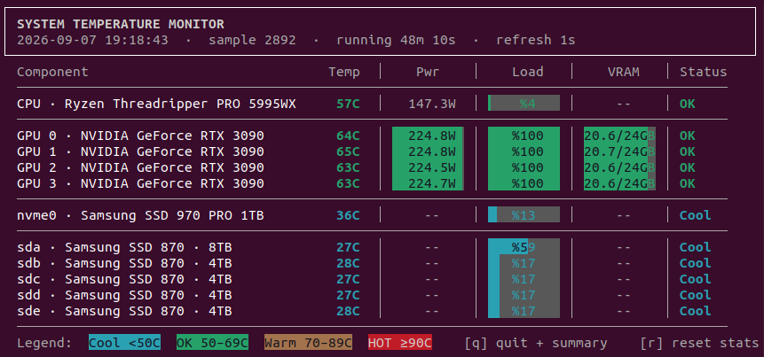

# ubuntu-system-monitor

Terminal dashboard for CPU / GPU / NVMe / SATA temperatures, power, load and GPU VRAM.
Pure Python 3 stdlib + curses; every data source is auto-detected, so it runs on any Ubuntu
(or other Linux) and shows whatever that machine exposes.



## Quick start

```bash
git clone <this repo> && cd ubuntu-system-monitor
bash doctor.sh              # what will this machine show? anything to fix?
bash install.sh             # → ~/.local/bin, GNOME shortcut Ctrl+Shift+Alt+T
sudo bash root_setup.sh     # optional: CPU power (RAPL) + SATA temps (drivetemp)
temp_monitor.sh [interval]  # default 1 s; q quits + summary, r resets stats
```

No root is needed to run. `install.sh` and `root_setup.sh` are idempotent.

## Adopting on another machine

`docs/ADOPTING.md` — detect the hardware, validate each data source, bind a key on any desktop,
and what to expect on Intel / AMD / ARM / non-NVIDIA systems.

## Reference

`docs/REFERENCE.md` — columns and gauges, colour thresholds, how each value is read, terminal
requirements, debugging.

## Files

| File | Purpose |
|---|---|
| `temp_monitor.sh` | entry point (execs the Python file next to it) |
| `temp_monitor.py` | the dashboard |
| `doctor.sh` | detect data sources + validate runtime (read-only) |
| `install.sh` | per-user install + GNOME shortcut |
| `root_setup.sh` | optional `sudo`: RAPL counters readable, `drivetemp` module |

License: MIT.
